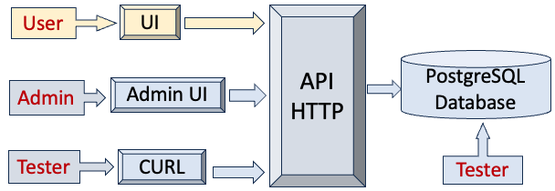
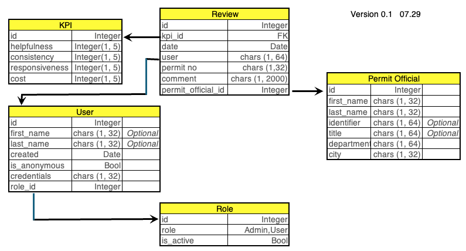

# RatePermitOfficial
Patrick Nicolas - 
Web application to rate building permit municipality officials    
Current version 0.1

## Environment
Python interpreter and modules ...    
 
|Library    | Version |
|:----------|:--------|
|Python:    | 3.11    |
|fastAPI:   | 0.111.0 |    
|matplotlib:| 3.9.1   |    
|SQLAchemy: | 2.0.31  |
|pydantic:  | 2.8.2   |
|pytest:    | 8.2.2   |
|psycopg2:  | 2.9.9   | 
|sqlparse:  | 0.4.4   |
|path:      | 16.14.0 |

## Requirements

| Feature Category    | Feature Description                                                                                                    | Comments       |
|:--------------------|:-----------------------------------------------------------------------------------------------------------------------|:---------------|
| __User Account__    | User registration and login functionality                                                                              | 	              |
|                     | Profile management (with options for anonymity)                                                                        |                |
| __Review System__   | Ability for users to submit reviews anonymously                                                                        |                |
|                     | Users rate on a scale of 1-5 for the following KPIs: Helpfulness, Consistency of Information, Time to Get Permit, Cost | Should each KPI appear on the UI?               |
|                     | Text field for up to 500 character reviews                                                                             |Spell checker? Characters counter? |
|                     | Dropdown menu for selecting permit type                                                                                | |
| __Data Collection__ | Collect ratings for each KPI separately                                                                                |
|                     | Calculate and display an average "Buildability Score" based on the KPI ratings                                         | Buildability score to be stored?|
| __Search Functionality__| Search by building department or employee                                                                              
| | Filter reviews by date, score, and permit type                                                                         | |
| __Security & Privacy__ | Ensure all user data is securely stored                                                                                | |
| | Implementation of privacy controls to maintain reviewer anonymity                                                      | Need more details|
| __UI/UX Design__ | User-friendly interface with intuitive navigation                                                                      | Need wireframe or snapshots |
| | Responsive design suitable for various devices (desktop, tablet, mobile)                                               |  What are the performance metrics/objectives |
| __Reporting__ | Option for users to report inaccurate reviews or abuse                                                                 | Feedback test box? Email? Phone ?|
| __Administration Panel__ | Dashboard for administrators to manage reviews and user accounts                                                       | Design needed |
| | _Role definition and display admin, users,_                                                                            | Admin? User? Super user? |
| | _Pre-populated table for city employees_                                                                               | Pre loaded from CSV file? |
| | Tools to analyze data trends and generate reports on KPI metrics                                                       | |
| __Compliance & Legal__ | Ensure compliance with data protection laws (like GDPR, CCPA)                                                          | Reference document needed |
| __Integration__ | Link platform with existing domain (buildability.io)                                                                   | Deployment on Heroku |
| __Feedback Mechanism__ | Option for users to provide feedback on the platform itself                                                            | See above |
| __Help__ | FAQ section                                                                                                            | Contextual online helpo? |
| | Contact form for user support                                                                                          | |
| __Deployment__ | _QA (Integration testing, Performance eval,...)_                                                                       | |
| | _Production monitoring (Alerts, Notification, Triage, Dashboard,)_                                                     | |
| | _Dev Ops tools (K8, Release processes, Recovery, Cloud provider,)_                                                     | |
| | _Google analytics_ | |

## Software components
| Component     | Description |
|:--------------|:----------------|
| __static__    | Images, CSS style |
| __templates__ | HTML pages |
| __src/db__    | Data base classes and methods |
| __src/web__ | Web services API |
| __src/util__ | Utilities classes |

## Architecture
   
   
There are 4 clients:
- __SQL__ Testing schema and pre-populating some tables   
- __CURL__ Testing HTTP requests/responses (see paragraph below)
- __Admin interface__ Monitoring data content
- __User interface__ for deployment in production 

## Database schema

## Local deployment (MacOS)
PostgreSQL version 16
### Service management
- brew services start postgresql    
- brew services restart postgresql     
- brew services stop postgresql     
- brew services info postgresql    

### Role management
__psql -U postgres__   

username = pat_nicolas
- CREATE ROLE $username WITH LOGIN PASSWORD 'xxxxx';    
- ALTER ROLE $username WITH superuser;  
- ALTER ROLE $username WITH createdb;  
    
__\du__    # psql command to list current roles

### Create database
database = test_rating          
CREATE DATABASE $database OWNER $username;       
GRANT ALL PRIVILEGES ON DATABAE $database TO $username

### Manage tables
psql -U $username -d $database     
__\dt__ Psql command to list tables    
Important note: _Tables are created through Python SQL Alchemy module_

### Password encryption
- Passwords are encrypted using the __Fernet cryptography__     
- File content can be also optionally encrypted using the same scheme.

### Command line interface
#### Landing page

curl \    
  --request GET \    
  --url http://localhost:8089/ \    
  --header 'Content-Type: text/plain'

#### List building permit officials  

curl \   
  --request GET \    
  --url http://localhost:8089/permitofficials \     
   --header 'Content-Type: text/plain'      

#### List users 

curl \   
  --request GET \    
  --url http://localhost:8089/users \     
   --header 'Content-Type: text/plain'

#### List reviews

curl \   
  --request GET \    
  --url http://localhost:8089/reviews \     
   --header 'Content-Type: text/plain'      

#### Posting a review
   
curl \   
  --request POST \
  --url http://localhost:8089/postreview \      
  --header 'Content-Type: application/json' \
  --data '{"permitofficial":"Lady Gaga", "permit":"43143", "helpfulness":2, "consistency":4, "responsiveness":3, "cost":2, "comment":"This is a comment for testing purpose"}'

## Implementation updates

| Date     | Changes                                                                       |
|:---------|:------------------------------------------------------------------------------|
| 07/18/24 | Review requirements and estimates                                             |
| 07/20/24 | PostgreSQL database and Gitub project setup                                   |    
| 07/22/24 | Design schema for project.                                                    |    
| 07/25/24 | Implementation Reviews, KPI, Users, Permit officials & Roles tables.          |
| 07/26/24 | Implementation of CRUD functions for tables                                   |
| 07/30/24 | Implementation of Fast API for loading building permits officials data        |
| 07/31/24 | Implementation of index page with CSS style                                   | 
| 08/01/24 | Implementation of permitofficials page                                        |
| 08/02/24 | Implementation of join {Review, KPI, PermitOfficial} - Password Encryption.   |                                                                                                        |
| 08/05/24 | Javascript code to load list of existing building permit officials and select |
| 08/13/24 | Automate creation and population of 5 database tables for testing purpose     |
| 08/14/24 | Integration of HTTP request with database for input of reviews                |
| 08/15/24 | First version of administrator interface |
